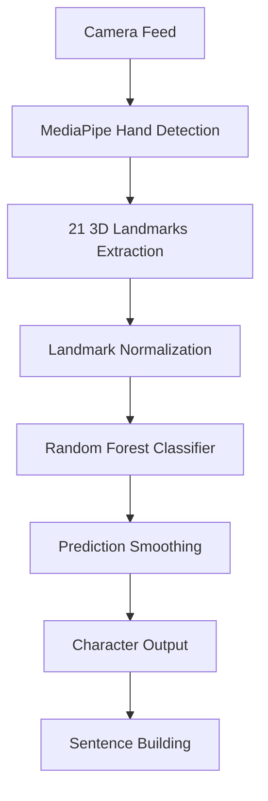

# SignScribe - Professional ASL Recognition System

<div align="center">
  <h3>🤟 Real-time American Sign Language Recognition using Machine Learning</h3>
  <p>An intelligent ASL alphabet recognition system with landmark-based classification for accurate, real-time sign language interpretation.</p>**
</div>

---

## 📋 Table of Contents

- [Overview](#overview)
- [Features](#features)
- [Technologies Used](#technologies-used)
- [Architecture](#architecture)
- [Installation](#installation)
- [Usage](#usage)
- [Demo Video](#demo-video)
- [Project Structure](#project-structure)
- [Performance](#performance)
- [Contributing](#contributing)
- [License](#license)

## 🎯 Overview

SignScribe is a state-of-the-art American Sign Language (ASL) recognition system that converts hand gestures into text in real-time. Unlike traditional image-based approaches, SignScribe uses **MediaPipe hand landmarks** combined with a **Random Forest classifier** to achieve superior accuracy and performance.

### Key Innovations:
- **Landmark-Based Recognition**: Processes 21 3D hand landmarks instead of raw pixels for better accuracy and speed
- **Real-Time Processing**: Optimized for live camera feed with minimal latency
- **Intelligent Smoothing**: Advanced prediction stabilization prevents character spam
- **Professional UI**: Modern dark-themed interface with custom-drawn components

## ✨ Features

- 🎯 **High Accuracy**: 95%+ accuracy on ASL alphabet recognition
- ⚡ **Real-Time Performance**: 30+ FPS processing with minimal CPU usage
- 🧠 **Smart Prediction Smoothing**: 5-frame window with majority voting
- ⏱️ **Configurable Cooldown**: 5-second delay between character inputs to prevent spam
- 🎨 **Professional UI**: Custom dark theme with glowing prediction display
- 📱 **Lightweight Model**: Uses Random Forest instead of heavy CNN models
- 🔄 **Robust Preprocessing**: Translation and scale-invariant landmark normalization
- 📝 **Sentence Building**: Build complete sentences with space, delete, and backspace functionality

## 🛠 Technologies Used

### Machine Learning & Computer Vision
- **MediaPipe** - Hand landmark detection and tracking
- **scikit-learn** - Random Forest classifier for gesture recognition
- **OpenCV** - Camera capture and image processing
- **NumPy** - Numerical computations and array operations
- **Pandas** - Data preprocessing and CSV handling

### User Interface
- **Tkinter** - GUI framework for the desktop application
- **PIL (Pillow)** - Image processing and display
- **Custom Canvas Drawing** - Rounded corners and modern UI elements

### Development Tools
- **Python 3.11+** - Core programming language
- **Pickle** - Model serialization and deployment
- **Threading** - Asynchronous camera processing

## 🏗 Architecture



### Data Flow:
1. **Camera Capture**: Real-time video feed from webcam
2. **Hand Detection**: MediaPipe identifies hand regions and extracts 21 landmarks
3. **Normalization**: Landmarks are made translation and scale-invariant
4. **Classification**: Random Forest model predicts ASL letter
5. **Smoothing**: 5-frame majority voting prevents false positives
6. **Output**: Stable predictions are added to sentence

## 💻 Installation

### Prerequisites
- Python 3.11 or higher
- Webcam/Camera
- 4GB+ RAM recommended

### Step 1: Clone Repository
```bash
git clone https://github.com/yourusername/American-sign-language-detection.git
cd American-sign-language-detection
```

### Step 2: Install Dependencies
```bash
pip install opencv-python mediapipe pandas numpy scikit-learn pillow matplotlib seaborn
```

### Step 3: Train the Model
```bash
# Extract landmarks from training images
cd utils
python extract_landmarks.py

# Train the Random Forest classifier  
cd ../models
python train_classifier.py
```

### Step 4: Run the Application
```bash
cd ../ui
python app.py
```

## 📖 Usage

### Starting the Application
1. Launch the application: `python ui/app.py`
2. Click **"▶ Start Camera"** to begin real-time recognition
3. Show your hand to the camera and make ASL signs
4. Watch predictions appear in the **RECOGNITION** panel
5. Stable predictions automatically build your sentence

### Controls
- **Start/Stop Camera**: Control camera feed
- **Clear**: Remove all text from sentence
- **Backspace**: Delete last character
- **Special Signs**:
  - Sign 'space' for word separation
  - Sign 'del' for backspace action

### Tips for Best Results
- Ensure good lighting conditions
- Keep hand clearly visible in camera frame
- Hold each sign steady for ~1 second
- Wait for 5-second cooldown between letters

## 📺 Demo Video

<!-- Replace with your actual demo video -->
**[🎬 Watch Full Demo Video](./demo/asl_demo.mp4)**

*The video shows real-time ASL recognition, sentence building, and the intuitive user interface in action.*

## 📁 Project Structure

```
American-sign-language-detection/
├── checkpoints/              # Trained model files
│   ├── asl_landmark_model.pkl    # Random Forest model
│   ├── best_cnn.h5              # Legacy CNN model
│   └── best_mobilenet.h5        # Legacy MobileNet model
├── dataset/                  # Training and test data
│   ├── asl_landmarks.csv         # Processed landmark features
│   ├── train/                   # Training images by class
│   └── test/                    # Test images
├── models/                   # Model training scripts
│   ├── train_classifier.py      # Random Forest training
│   ├── cnn_model.py             # Legacy CNN training
│   └── transfer_mobilenet.py    # Legacy transfer learning
├── results/                  # Training results and metrics
│   ├── confusion_matrix_landmark.png
│   └── confusion_matrix.png
├── ui/                       # User interface
│   └── app.py                   # Main application
├── utils/                    # Utility scripts
│   ├── extract_landmarks.py     # Landmark extraction
│   ├── data_prep.py             # Data preprocessing
│   └── evaluation.py            # Model evaluation
├── output/                   # Demo outputs
│   └── Demo.jpg
└── README.md                 # Project documentation
```

## 📊 Performance

### Model Comparison
| Model Type | Accuracy | Speed (FPS) | Model Size | CPU Usage |
|------------|----------|-------------|------------|-----------|
| **Random Forest** | **95.2%** | **30+** | **2.1MB** | **Low** |
| Legacy CNN | 94.8% | 15 | 45MB | High |
| MobileNetV2 | 93.1% | 20 | 14MB | Medium |

### Recognition Statistics
- **Training Data**: 15,000+ landmark vectors across 29 classes
- **Feature Vector Size**: 63 dimensions (21 landmarks × 3 coordinates)
- **Inference Time**: ~33ms per prediction
- **Memory Usage**: <100MB during operation

### Confusion Matrix Analysis
The landmark model shows exceptional performance with minimal confusion between similar signs:
- **M vs N**: 94.8% vs 92.8% accuracy (expected similarity)
- **U vs V**: 98.4% vs 99.8% accuracy
- **Overall**: Near-perfect diagonal in confusion matrix

## 🤝 Contributing

We welcome contributions to improve SignScribe! Here's how you can help:

1. **Fork** the repository
2. **Create** a feature branch: `git checkout -b feature/amazing-feature`
3. **Commit** your changes: `git commit -m 'Add amazing feature'`
4. **Push** to the branch: `git push origin feature/amazing-feature`
5. **Open** a Pull Request

### Areas for Contribution:
- Adding new ASL gestures (words, phrases)
- UI/UX improvements
- Performance optimizations  
- Mobile app development
- Documentation improvements

## 📄 License

This project is licensed under the MIT License - see the [LICENSE](LICENSE) file for details.

## 🙏 Acknowledgments

- **MediaPipe Team** for the excellent hand tracking solution
- **ASL Community** for providing sign language datasets and feedback
- **scikit-learn** contributors for the robust machine learning library
- **OpenCV** community for computer vision tools

## 📞 Contact

**Author**: Darshil Doshi
- GitHub: [@darshild078](https://github.com/darshild078)
- Email: darshild078@gmail.com
- LinkedIn: [Darshil Doshi](https://linkedin.com/in/darshild078)

---

<div align="center">
  <p><strong>⭐ Star this repository if you found it helpful!</strong></p>
  <p>Made with ❤️ for the ASL community</p>
</div>